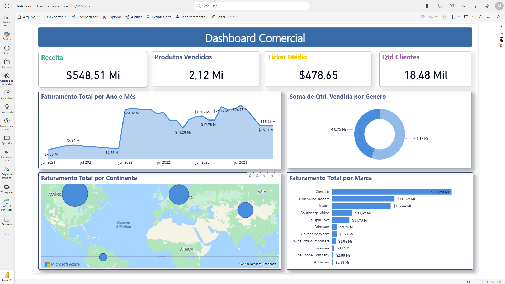
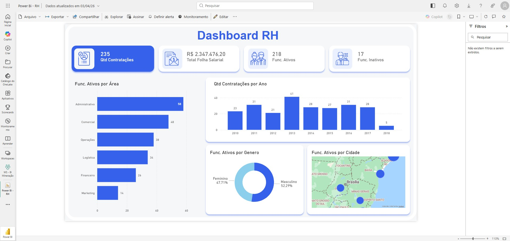
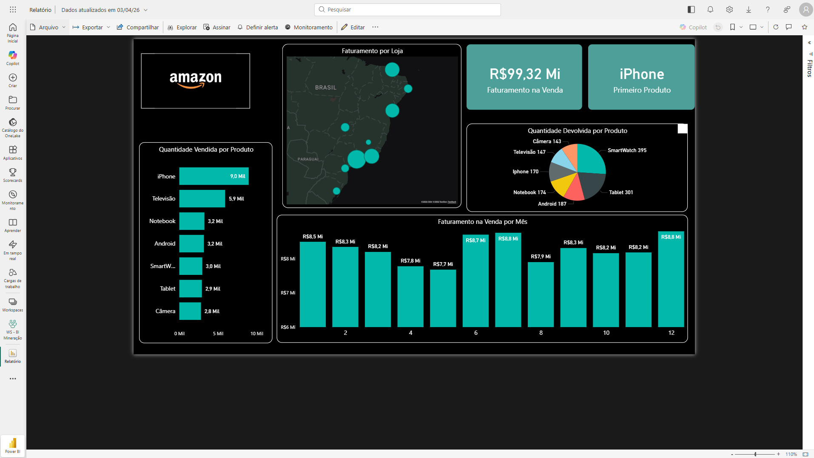
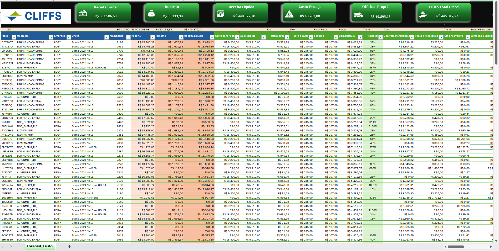

## 🚛 Dashboard de Auditoria Logística e Produtividade (Power BI)

Desenvolvido para o setor de transportes e logística, este painel atua como uma ferramenta robusta de auditoria operacional. Automatiza a conferência de emissões de fretes (CTRC), garantindo o *compliance* das regras de negócio e monitorizando o desempenho e a qualidade da equipe de analistas.

**Principais técnicas e recursos aplicados:**
* **DAX Avançado e Grupos de Cálculo (Calculation Groups):** Aplicação de modelação avançada e grupos de cálculo para otimizar medidas dinâmicas, inteligência de tempo e regras de negócio complexas, garantindo alta performance de processamento.
* **Validação de Emissões e Trava de CNPJ:** Cruzamento inteligente de dados para identificar divergências entre a unidade emissora real e a unidade esperada, mapeando falhas de roteamento.
* **Auditoria de Fretes e Tarifas:** Visão detalhada para validação financeira, cruzando valores de mercadoria, taxas de gestão de risco (GRIS) e cotações.
* **Controlo de Produtividade e Qualidade (Taxa de Erro):** Acompanhamento de KPIs de volume de emissões e ranking dinâmico de analistas pela percentagem de emissões incorretas, fornecendo dados exatos para aplicação de feedback e formação.

> ⚠️ **Nota de Privacidade e Compliance:** Em respeito à proteção de dados e às melhores práticas de segurança, **todos os dados apresentados neste projeto (nomes de clientes, empresas, CNPJs, valores financeiros, rotas e logins de analistas) são 100% fictícios (mock data)**. Estes foram gerados e anonimizados exclusivamente para demonstrar a arquitetura lógica, modelação e competências técnicas na ferramenta.

### 📊 Ecrãs do Projeto

**1. Validação de Unidade Emissora**
Visão geral de auditoria de unidades emissoras, comparando a unidade de origem com a esperada, incluindo o ranking de qualidade por analista e volume por cliente.

**2. Produtividade da Equipa**
Acompanhamento detalhado de KPIs operacionais (volume de emissões, valor total, médias), distribuição de trabalho por turnos e ranking de precisão/erros por analista.

**3. Trava de CNPJ**
Painel focado no *compliance* de cadastros, validando as regras de negócio de CNPJs (Remetente, Destinatário, Expedidor) e sinalizando divergências na matriz de expedição.

**4. Validação e Observação de Fretes**
Auditoria financeira granular ao nível do conhecimento de transporte, cruzando o valor da mercadoria com o cálculo de GRIS, frete sem ICMS e rateios de cotação.

---

# 📊 Portfólio de Dashboards em Power BI e Excel

Bem-vindo ao meu portfólio de dados! 📊 Aqui apresento meus projetos focados em transformar dados em inteligência de negócios.

**Minhas especialidades incluem:**
* Desenvolvimento de Dashboards em Power BI e Excel.
* Análise e tratamento de dados.
* Monitoramento de métricas e KPIs para decisões estratégicas.

---

## 📈 Dashboard Comercial (Power BI)
Painel desenvolvido para análise de métricas de vendas, faturamento por continente, ticket médio, quantidade de clientes e desempenho por marca.

---

## 👥 Dashboard de Recursos Humanos - RH (Power BI)
Controle interativo de RH, monitorando a quantidade de contratações por ano, total da folha salarial, funcionários ativos por área e distribuição demográfica.

---

## 🛒 Dashboard E-commerce (Power BI)
Análise detalhada de vendas online simulando um ambiente de e-commerce, destacando faturamento por loja física/região, produtos mais vendidos e índice de devoluções.

---

## 🚚 Dashboard de Análise de Custos Operacionais (Excel)
Painel financeiro e operacional avançado, desenvolvido 100% em Excel para o controle estratégico de frota e logística. O projeto consolida dados de múltiplas fontes (sistemas de pedágio, telemetria, abastecimento, manutenção e locação) para apresentar o detalhamento de receita bruta, receita líquida, impostos e custos precisos por veículo.

**Principais técnicas e fórmulas aplicadas:**
* **Cruzamento de Dados (Relacionamento):** Utilização intensiva de funções de busca (`PROCX`, `PROCV` ou `ÍNDICE/CORRESP`) para unificar informações de mais de 7 bases de dados diferentes, utilizando a placa do veículo como chave primária.
* **Cálculos e Agregações Condicionais:** Aplicação de `SOMASES` e funções lógicas (`SE`, `E`, `OU`) para consolidar os gastos com diesel, pedágio, oficina e depreciação, segmentando por operação e por frota.
* **Tratamento e Integridade de Dados:** Uso de `SEERRO` para tratamento de exceções, garantindo que o dashboard funcione perfeitamente sem exibir erros visuais quando há lacunas nas bases de origem.
* **Modelagem:** Estruturação profissional separando abas de parâmetros (dimensões) das abas de consolidação e fatos (como a aba *Forecast Custo*), otimizando o processamento do arquivo.

> ⚠️ **Nota de Privacidade e Compliance:** Em respeito à LGPD e às melhores práticas de segurança, todos os dados operacionais e financeiros deste projeto (como placas, valores e rotas) foram embaralhados, mascarados e anonimizados. Os números apresentados são estritamente fictícios e servem exclusivamente para demonstrar a arquitetura lógica e as habilidades técnicas na ferramenta.

**📥 [Clique aqui para baixar a planilha modelo (.xlsx) e visualizar a estrutura de relatórios](ANALISE_DE_CUSTO_EXCEL.xlsx)**

<!--
---

### 🚚 Dashboard de Auditoria Logística e Produtividade (Power BI)

Desenvolvido para o setor de transportes e logística, este painel atua como uma ferramenta robusta de auditoria operacional. Ele automatiza a conferência de emissões de fretes (CTRC), garantindo o *compliance* das regras de negócio e monitorando o desempenho e a qualidade da equipe de analistas.

**Principais análises e recursos:**
* **Validação de Emissões e Trava de CNPJ:** Cruzamento inteligente de dados para identificar divergências entre a unidade emissora real e a unidade esperada, mapeando falhas de roteirização e regras de CNPJ.
* **Auditoria de Fretes e Tarifas:** Visão detalhada para validação financeira, cruzando valores de mercadoria, taxas de gerenciamento de risco (GRIS) e cotações.
* **Gestão de Produtividade (Equipe):** Acompanhamento de KPIs de volume de emissões (em quantidade e valor financeiro) segmentado por login, cliente e turno de trabalho.
* **Controle de Qualidade (Taxa de Erro):** Ranking dinâmico de analistas pelo percentual de emissões incorretas, fornecendo dados exatos para aplicação de feedbacks e treinamentos de melhoria contínua.

